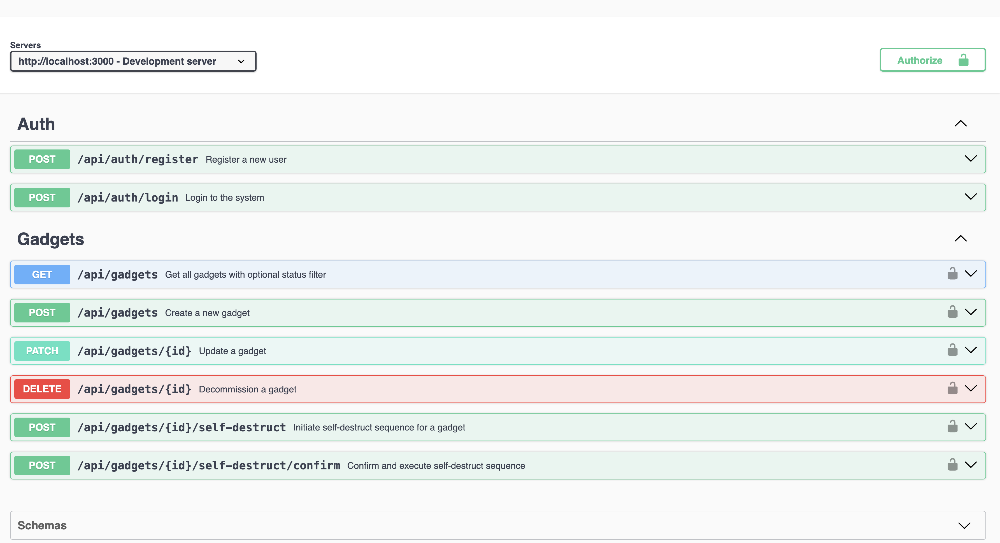

# IMF Gadgets Management System

A secure RESTful API for managing IMF's top-secret gadgets. Built with Node.js, Express, TypeScript, and TypeORM.

## Features

- 🔐 JWT Authentication & Authorization
- 👥 User Management (Agents & Admins)
- 🛠️ Gadget Management System
- 📊 Status Tracking (Active, Decommissioned, Destroyed)
- 🔥 Self-Destruct Sequence with Two-Step Verification
- 📚 Swagger API Documentation
- 🗃️ TypeORM Database Integration
- 🔒 Secure Password Hashing

## Prerequisites

- Node.js (v14 or higher)
- PostgreSQL (or your preferred database)
- npm or yarn

## Installation

1. Clone the repository:

```bash
git clone https://github.com/ravix007/imf-gadgets.git
cd imf-gadgets
```

2. Install dependencies:

```bash
npm install
```

3. Create a `.env` file in the root directory:

```env
PORT=3000
JWT_SECRET=your-secret-key
DB_HOST=localhost
DB_PORT=5432
DB_USERNAME=your_username
DB_PASSWORD=your_password
DB_DATABASE=imf_gadgets
```

4. Start the development server:

```bash
npm start
```

## API Documentation

The API documentation is available at `/api-docs` when the server is running. You can explore and test all endpoints using the Swagger UI interface.

### Main Endpoints

#### Authentication

- `POST /api/auth/register` - Register a new user
- `POST /api/auth/login` - Login and receive JWT token

#### Gadgets

- `GET /api/gadgets` - Get all gadgets (supports status filter)
- `POST /api/gadgets` - Create a new gadget
- `PATCH /api/gadgets/:id` - Update a gadget
- `DELETE /api/gadgets/:id` - Decommission a gadget
- `POST /api/gadgets/:id/self-destruct` - Initiate self-destruct sequence
- `POST /api/gadgets/:id/self-destruct/confirm` - Confirm self-destruct

## Authentication

The API uses JWT tokens for authentication. Include the token in the Authorization header:

```bash
Authorization: Bearer <your_jwt_token>
```

## Database Schema

### Users

- id (UUID)
- email (unique)
- password (hashed)
- role (AGENT/ADMIN)
- createdAt
- updatedAt

### Gadgets

- id (UUID)
- name
- codename
- description
- status (Active/Decommissioned/Destroyed)
- decommissionedAt
- createdAt
- updatedAt

## Development

### Project Structure

```
src/
├── config/         # Configuration files
├── controllers/    # Request handlers
├── middleware/     # Custom middleware
├── models/         # Database models
├── routes/         # Route definitions
├── services/       # Business logic
├── types/          # TypeScript type definitions
└── utils/          # Utility functions
```

## Security Features

- Password hashing with bcrypt
- JWT token authentication
- Input validation
- Error handling
- Rate limiting
- CORS protection

## Error Handling

The API uses standard HTTP status codes:

- 200: Success
- 201: Created
- 400: Bad Request
- 401: Unauthorized
- 403: Forbidden
- 404: Not Found
- 500: Internal Server Error

## Screenshot of working Application


